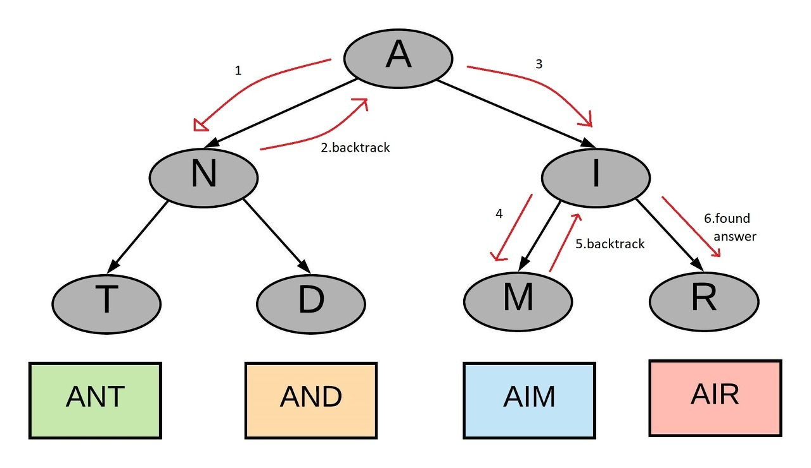
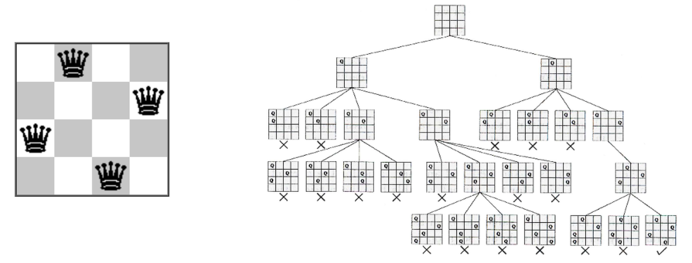

# 18th_study

### 18주차 알고리즘스터디

# 지난주 문제

<details>
<summary>접기/펼치기</summary>
<div markdown="1">

## [문자의 빈도](https://www.codetree.ai/problems/frequency-of-characters/description)

### [민웅](<./문자의 빈도/민웅.py>)

```py
import sys
input = sys.stdin.readline

N = int(input().strip())

for _ in range(N):
    msg = input().strip()
    msg_dict = {}

    max_cnt = 0
    ans = ''
    ans_check = False
    for i in range(len(msg)):
        tmp = msg[i]
        if tmp in msg_dict.keys():
            msg_dict[tmp] += 1
        else:
            msg_dict[tmp] = 1

    for key, item in msg_dict.items():
        if item > max_cnt:
            ans = key
            max_cnt = item
            ans_check = False
        elif item == max_cnt:
            ans_check = True
    
    if ans_check:
        print('?')
    else:
        print(ans)
```

### [상미](<./문자의 빈도/상미.py>)

```py

```

### [병국](<./문자의 빈도/병국.py>)

```py
n = int(input())
for _ in range(n):
    dict = {}
    arr = list(input())
    for i in arr:
        if i in dict:
            dict[i] += 1
        else:
            dict[i] = 1
    maxx = 0
    answer = ''
    flag = True
    for i in (dict):
        # print(dict[i])
        if dict[i] > maxx:
            maxx = dict[i]
            answer = i
            flag = True
        elif dict[i] == maxx:
            flag = False
    if flag == True:
        print(answer)
    else:
        print("?")
```

### [성구](./문자의%빈도/성구.py)

```py
import sys
from collections import defaultdict
input = sys.stdin.readline


def solution(n:int, strs:list) -> None:
    for s in strs:
        cnts = defaultdict(int)
        for i in s:
            cnts[i] += 1
        cnt = sorted(cnts.keys(), key=lambda x: cnts[x], reverse=1)
        tmp = cnts[cnt[0]]
        aa = 0
        for c in cnt:
            if cnts[c] != tmp:
                break
            aa += 1
        if aa > 1:
            print("?")
        else:
            print(cnt[0])
        
    return


if __name__ == "__main__":
    n = int(input())
    strs = [input().strip() for _ in range(n)]
    solution(n, strs)
```

<br/><br/>

## [코드트리 마트](https://www.codetree.ai/problems/codetree-market/description)

### [민웅](./코드트리%마트/민웅.py)

```py
import sys
import heapq
# from collections import deque
input = sys.stdin.readline

N, K = map(int, input().split())
customers = []

for i in range(1, N+1):
    t, s = map(int, input().split())
    heapq.heappush(customers, [t, s, i])


first = heapq.heappop(customers)
time = first[0]
q = []
heapq.heappush(q, [-1*first[1], first])
ans = []

while customers or q:
    while True:
        if customers:
            tmp = heapq.heappop(customers)
            # print("tmp는", tmp)
            if tmp[0] <= time:
                # print("들어간 tmp", tmp)
                heapq.heappush(q, [-1*tmp[1], tmp])
            else:
                heapq.heappush(customers, tmp)
                # print(q)
                break
        else:
            break
    # q.sort(key=lambda x: (-1*x[1]))
    cus = heapq.heappop(q)
    ans.append(cus[1][2])
    time += K
    # print(time)
print(*ans)
```

### [상미](./코드트리%마트/상미.py)

```py


```

### [병국](./코드트리%마트/병국.py)

```py

```

### [성구](./코드트리%마트/성구.py)

```py
import sys, heapq
input = sys.stdin.readline


def solution(N:int, K:int, wait:list) -> list:
    sequence = [0] * N
    que = []
    now, last = 0, 0
    heapq.heappush(que, (-wait[0][2], wait[0][1], wait[0][0]))
    time = wait[0][1]
    while que:
        weight, t, idx = heapq.heappop(que)
        sequence[now] = idx
        now += 1
        time += K
        for w in range(last+1, N):
            if wait[w][1] <= time:
                heapq.heappush(que, (-wait[w][2], wait[w][1], wait[w][0]))
                last = w
            else:
                break
    return sequence


if __name__ == "__main__":
    N, K = map(int, input().split())
    wait = []
    for idx in range(N):
        t, s = map(int, input().split())
        wait.append((idx+1, t, s))
    wait.sort(key=lambda x:(x[1],-x[2]))
    ans = solution(N, K, wait)
    print(" ".join(list(map(str, ans))))
```

<br>

## [기차 놀이](https://www.codetree.ai/problems/train-game/description)

### [민웅](<./기차 놀이/민웅.py>)

```py
import sys
from collections import deque
# input = sys.stdin.readline
# 1번 -> 앞블럭을 뒤로, 2번 -> 뒷블럭을 앞으로, 3번 -> 두 개 선로 이어붙이기

N, M, Q = map(int, input().split())
tracks = [deque() for _ in range(M)]

idx = 1
for i in range(M):
    for j in range(N//M):
        tracks[i].append(idx)
        idx += 1
# print(tracks)
for _ in range(Q):
    p, *num = map(int, input().split())
    if p == 1:
        if tracks[num[0]]:
            tracks[num[0]].append(tracks[num[0]].popleft())
    elif p == 2:
        if tracks[num[0]]:
            tracks[num[0]].appendleft(tracks[num[0]].pop())
    else:
        a, b = num[0], num[1]
        while tracks[a]:
            tracks[b].appendleft(tracks[a].pop())
    
for t in tracks:
    if t:
        print(*t)
    else:
        print(-1)
```

### [상미](<./기차 놀이/상미.py>)

```py

```

### [병국](<./기차 놀이/병국.py>)

```py
from collections import deque
n,m,q = map(int,input().split())
# 1 2 3
# 4 5 6

# 첫번째놀이 > 1 2 3 >>> 2 3 1
# 두번째놀이 > 1 2 3 >>> 3 1 2 
#  2 3 1 > 3 1 2
#  456 > 645
# 세번째놀이 
train = [deque() for _ in range(m)]
idx = 1
for i in range(len(train)):
    for j in range(n//m):
        train[i].append(idx)
        idx+=1
# print(train)


for _ in range(q):
    arr = list(map(int,input().split()))
    # arr = [3,0,1]
    if arr[0] == 1:
        if train[arr[1]]:
            train[arr[1]].append(train[arr[1]].popleft())
    elif arr[0] == 2:
        if train[arr[1]]:
            train[arr[1]].appendleft(train[arr[1]].pop())
    elif arr[0] == 3:
        train[arr[2]] = train[arr[1]]+train[arr[2]]
        train[arr[1]] = deque()
# print(train)
        # aa = train.pop()
        # print(aa,'sad')
        # print(train,'asdqqq')\
# print(train)
for i in range(len(train)):
    if len(train[i]) == 0:
        print(-1)
    else:
        for j in train[i]:
            print(j, end= ' ')
        print()
```

### [성구](./기차%놀이/성구.py)

```py
import sys
from collections import deque
input = sys.stdin.readline

def solution():
    lines = []
    start = 1
    for _ in range(M):
        lines.append(deque([i for i in range(start, start+N//M)]))
        start += N//M
    for q in range(Q):
        order, *line = map(int, input().split())
        if order == 1:
            target = line[0]
            if lines[target]:
                s = lines[target].popleft()
                lines[target].append(s)
        elif order == 2:
            target = line[0]
            if lines[target]:
                e = lines[target].pop()
                lines[target].appendleft(e)
        else:
            a= line[0]
            b= line[1]
            lines[b] = lines[a] + lines[b]
            lines[a].clear()

    for i in range(M):
        if lines[i]:
            print(*lines[i])
        else:
            print(-1)
    return


if __name__ == "__main__":
    N, M, Q = map(int, input().split())
    solution()
```

<br/><br/>

</div>


</details>

</br></br></br>

# 이번주 문제

<details open>
<summary>접기/펼치기</summary>
<div markdown="1">

## [사다리 조작](https://www.acmicpc.net/problem/15684)

### [민웅](<./사다리 조작/민웅.py>)

```py
```

### [상미](<./사다리 조작/상미.py>)

```py

```

### [병국](<./사다리 조작/병국.py>)

```py
def check():
    for i in range(N):
        now = i
        for j in range(H):
            if ladder[j][now] == 1:
                now += 1
            elif now >= 1 and ladder[j][now-1] == 1:
                now -= 1
        # 하나라도 시작이랑 도착 다르면 바로 리턴
        if now != i:
            return False
    return True

def back(cnt, x, y):
    global answer
    if check(): # True면 된다는거
        answer = min(cnt,answer)
        return
    elif cnt == 3 or answer <= cnt:
        return

    # 가로선 탐색해보자,
    for i in range(x, H):
        # 아직 x행 보고 있으면
        if i == x:
            # 가로선 고정
            tmp = y
        else:
            tmp = 0
        # 세로선
        for j in range(tmp, N-1):
            # 내위치, 오른쪽위치에 사다리없으면
            if ladder[i][j] == 0 and ladder[i][j+1] == 0:
                # 근데 왼쪽에있다면..? 일직선되니까 패스
                if j > 0 and ladder[i][j-1] == 1:
                    continue
                ladder[i][j] = 1
                # 행은 같은데 열은 두칸뒤로 가야된다, 일직선 되면 안되니까.
                back(cnt+1,i,j+2)
                ladder[i][j] = 0


N, M, H = map(int,input().split())
ladder = [[0]*(N) for _ in range(H)]
for _ in range(M):
    a,b = map(int,input().split())
    ladder[a-1][b-1] = 1
# print(ladder)

answer = 4
back(0, 0, 0)
if answer < 4:
    print(answer)
else:
    print(-1)
```

### [성구](<./사다리 조작/성구.py>)

```py
# 15684 사다리 조작
import sys
input = sys.stdin.readline


def check_ladder() -> bool:
    for i in range(N):
        y, x = 0, i
        while y < H:
            if ladders[y][x] == 1:      # 1이면 왼쪽으로 이동
                x -= 1
            elif ladders[y][x] == 2:    # 2면 오른쪽으로 이동
                x += 1
            y += 1
        if x != i:      # i -> i 가 아닐경우 False
            return 0       
    return 1        # 모두 i -> i 되면 True

# 백트래킹
def bt(cnt:int, start_i:int) -> None:
    global ans
    
    if check_ladder():  # i-> i 체크
        # 된다면 cnt 저장
        ans = min(cnt, ans)
        return
    if cnt == 3:        # 3 이하일 때만 허용
        return 
    if cnt >= ans:
        return
    # i -> i가 안 될 경우, 탐색 중이었던 높이부터 체크하면 됨
    for i in range(start_i, H):
        for j in range(N-1):
            if not ladders[i][j] and not ladders[i][j+1]:
                ladders[i][j] = 2
                ladders[i][j+1] = 1
                bt(cnt+1, i)
                ladders[i][j] = 0
                ladders[i][j+1] = 0
    return


if __name__ == "__main__":
    N, M, H = map(int, input().split())
    ladders = [[0] * N for _ in range(H)]
    visited = [[0] * N for _ in range(H)]
    for _ in range(M):
        # 1 -> 왼쪽, 2 -> 오른쪽
        a, b = map(int, input().split())
        ladders[a-1][b-1] = 2
        ladders[a-1][b] = 1
    ans = 5
    bt(0,0)
    print(-1 if ans > 3 else ans)
        
```

</div>
</details>
<br><br>

# 알고리즘 설명

<details>
<summary>접기/펼치기</summary>

## 용어 정리

### 백트래킹

- **정의**: 모든 가능한 경우의 수 중에서 해를 찾는 방식
 But

- **DFS와의 차이점**: 해가 될 수 없는 경우를 조기에 배제함으로써, 불필요한 경우의 수를 줄이고 효율성을 높이는 알고리즘

- **특징**:
  - 가능한 모든 해를 시도하지만, 해가 유망하지 않다고 판단되면 다른 경로를 탐색

### ex) Air 라는 단어를 찾는 과정




## 대표 유형 N-Queen




### 예시문제

- 다음 두 가지 규칙을 지키면서 이진수를 만들고자 한다. 가능한 서로 다른 이진수의 개수를 구하는 프로그램을 작성하시오.

- 규칙1 : 길이는 N이다.

- 규칙2 : 1이 연속으로 존재하면 안된다.

- 예를 들어 길이가 3이라면, 길이가 3인 이진수는 다음과 같이 000, 001, 010, 011, 100, 101, 110, 111 8가지이다. 

- 이 중 1이 연속으로 사용된 3개를 제외한 000, 001, 010, 100, 101 의 5가지가 답이다.

## 
input - 3

output - ['000', '001', '010', '100', '101']

</details>
